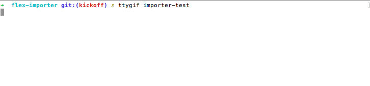

# Flex Example Importer

This is a small showcase on how to bootstrap a simple product import service with Symfony Flex.

## Requirements

* PHP >= 7.1.3
* Composer
* SQLite

## Steps

### 1. Create project

```bash
$ composer create-project symfony/skeleton:^4.0@beta flex-importer
$ cd flex-importer
$ composer require logger orm 
```


   
### 2. Configure your database

In this example we are using sqlite

```bash
$ cp .env.dist .env
```

Open `.env` file and set your `DATABASE_URL` to `sqlite:///%kernel.project_dir%/var/data.db`

```bash
# .env
DATABASE_URL="sqlite:///%kernel.project_dir%/var/data.db"
```

Enforce parameter parsing with `resolve` keyword in doctrine config:

```yaml
# config/packages/doctrine.yaml
doctrine:
   dbal:
       url: '%env(resolve:DATABASE_URL)%'
```
More about [Advanced environment variables](https://symfony.com/blog/new-in-symfony-3-4-advanced-environment-variables)

### 3. Implement a small example entity and setup your database

```php
// src/Entity/Product.php

namespace App\Entity;

use Doctrine\ORM\Mapping as ORM;

/**
 * @ORM\Entity
 */
class Product
{
    /**
     * @ORM\Column(type="integer")
     * @ORM\Id
     */
    public $id;
    
    /** @ORM\Column */
    public $name;
 
    /** @ORM\Column(type="text") */
    public $description;
 
    /** @ORM\Column(type="integer") */
    public $price;
 
    /** @ORM\Column(type="integer") */
    public $taxRate;
 
    public static function fromArray(array $data): self
    {
        $instance = new static();
 
        $instance->id = $data['id'];
        $instance->name = $data['name'];
        $instance->description = $data['description'];
        $instance->price = $data['price'];
        $instance->taxRate = $data['taxRate'];
 
        return $instance;
    }
}
```

**Setup your database**

```bash
$ bin/console doctrine:schema:update --force
```
       
### 4. Bootstrap a small cli command as framework code

```php
// src/Command/ProductImportCommand.php

namespace App\Command;

class ProductImportCommand extends Command
{
    private $productImporter;
 
    public function __construct(ProductImporter $productImporter)
    {
        $this->productImporter = $productImporter;
        
        parent::__construct();
    }

    protected function configure(): void
    {
        $this
            ->setName('app:product:import')
            ->addArgument('file', InputArgument::REQUIRED, 'Path to import file');
    }

    protected function execute(InputInterface $input, OutputInterface $output): int
    {
        $io = new SymfonyStyle($input, $output);
        $file = $input->getArgument('file');
 
        $io->title('Product Import');
 
        $this->productImporter->importFile($file);
 
        $io->success('Successfully imported products.');
 
        return 0;
    }
}
```

### 5. Implement your import service as domain logic

```php

namespace App;

use App\Entity\Product;
use Doctrine\Common\Persistence\ObjectManager;

class ProductImporter
{
    private $entityManager;
 
    public function __construct(ObjectManager $entityManager)
    {
        $this->entityManager = $entityManager;
    }
 
    public function importFile(string $file): void
    {
        foreach ($this->readImportFile($file) as $data) {
            $product = Product::fromArray($data);
 
            $this->entityManager->persist($product);
            $this->entityManager->flush();
        }
    }
 
    private function readImportFile(string $file) : \Generator
    {
        $file = new \SplFileObject($file);
        $fields = $file->fgetcsv();
 
        while ($file->valid()) {
            $data = $file->fgetcsv();
            if (count($fields) === count($data)) {
                yield array_combine($fields, $data);
            }
        }
    }
}
```

### 6. Test your import with a sample csv file

```csv
"id", "name", "description", "price", "taxRate"
"123", "Soap", "Soap to wash your hands", "299", "19"
"234", "Milk", "Milk to eat with cereals", "119", "7"
"345", "Potatoes", "Potatos to cook and eat", "199", "7"
"456", "Pizza", "Frozen pizza for lazy Sundays", "219", "7"
"567", "Shirt", "To wear in summer", "999", "19"
"678", "Lego", "To play with", "2099", "19"
```

```bash
$ bin/console app:product:import products.csv
 
Product Import
==============
 
[OK] Successfully imported products.
```


